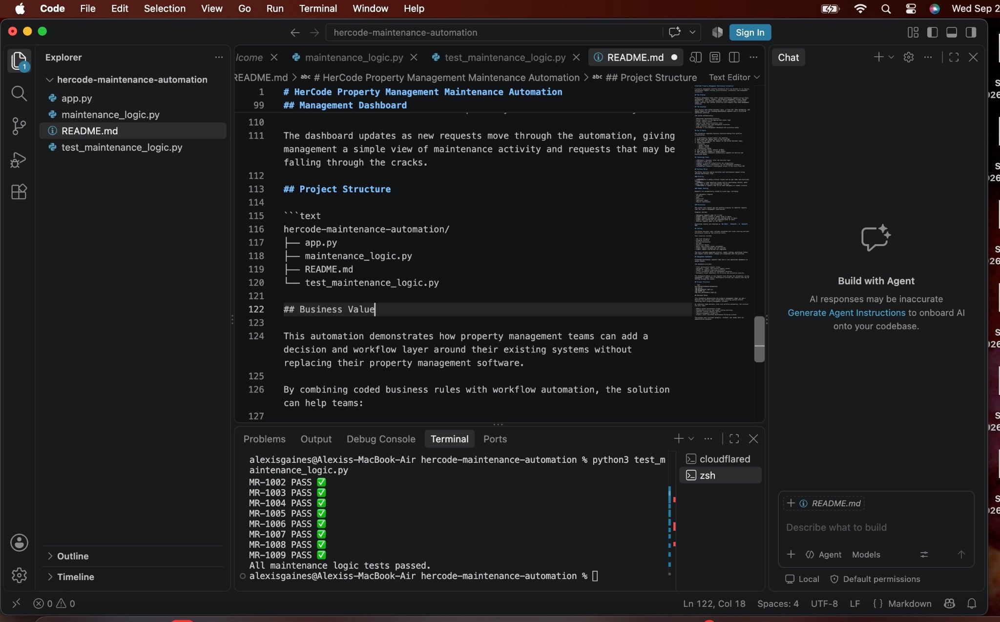
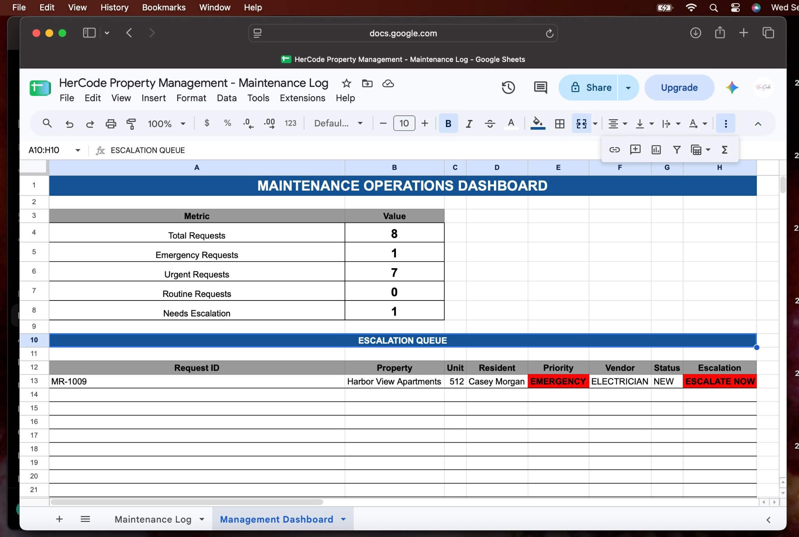

# HerCode Property Management Maintenance Automation

A property management workflow automation built by **HerCode LLC** to improve maintenance request prioritization, routing, escalation, and management visibility.

## The Problem

Property management teams often manage maintenance requests across forms, spreadsheets, emails, vendors, and property management systems.

Manual handoffs can create delayed responses, inconsistent routing, missed follow ups, and limited visibility into requests that need management attention.

## The Solution

This project demonstrates an operations workflow that combines **Python business logic, a Flask API, workflow automation, and a management dashboard** to move maintenance requests from submission toward resolution.

The system is designed to:

- Classify maintenance request priority
- Route requests by service category
- Track workflow status
- Evaluate request aging
- Flag requests requiring management review
- Log processed requests
- Provide management visibility into maintenance activity

## How It Works

The architecture separates business decision making from workflow orchestration.

1. A maintenance request enters the workflow.
2. The request is sent to a Flask API.
3. The API passes the request to the Python decision layer.
4. Python evaluates priority, routing, status, and escalation.
5. Structured results are returned to the automation workflow.
6. Processed requests are logged for operational tracking.
7. Management reporting provides visibility into request volume, status, and exceptions.

**Maintenance Request → API → Python Decision Engine → Workflow Automation → Operations Log → Management Visibility**

## Technology Stack

- **Python** — business logic and request processing
- **Flask** — API layer
- **Make** — workflow orchestration and integrations
- **Google Sheets** — operational logging and dashboard reporting
- **Cloudflare Tunnel** — development access to the local Flask API

## Python Decision Engine

The Python layer demonstrates a modular approach to maintenance operations logic.

Representative portfolio logic includes:

- Priority classification
- Service category routing
- Request status determination
- Time based review logic
- Structured JSON output

The public repository contains a functional portfolio implementation designed to demonstrate the architecture and coding approach.

Business rules can be configured for an organization's specific service standards, escalation policies, vendor structure, property types, and operational requirements.

## API Layer

The Flask application exposes the maintenance processing logic through an API endpoint.

This allows the decision engine to operate independently from the workflow platform and makes it possible to integrate the logic with different forms, databases, property management systems, or automation tools.

## Testing



The project includes automated tests covering representative maintenance scenarios and multiple workflow states.

The test suite validates core behavior including:

- Priority classification
- Service routing
- Escalation/review status
- Workflow status

This helps verify business logic before workflow changes are integrated into the larger automation.

## Management Dashboard



Processed maintenance requests feed into an operations dashboard designed to give management visibility into maintenance activity.

The dashboard demonstrates:

- Maintenance request volume
- Priority distribution
- Request status
- Requests requiring management attention
- Operational tracking and escalation visibility

The dashboard provides a simple management view while the underlying automation handles request processing and workflow decisions.

## Project Structure

```text
hercode-maintenance-automation/
├── app.py
├── maintenance_logic.py
├── test_maintenance_logic.py
├── screenshots/
│   ├── maintenance-dashboard.png
│   └── maintenance-tests.png
└── README.md
```

## Business Value

This project demonstrates how property management teams can add an automation and decision layer around existing operations without replacing their current property management software.

The approach can help organizations:

- Reduce repetitive maintenance triage
- Create more consistent request handling
- Improve routing and follow-up
- Identify requests requiring attention
- Improve management visibility
- Integrate business rules with existing systems and workflows

## Portfolio Note

This repository is a public technical demonstration of the solution architecture and development approach.

The public implementation intentionally uses representative business rules and sample data. Complete client specific configurations, operational policies, credentials, integration settings, and private deployment details are not included.

All property, resident, and operational data used in this demonstration is fictional.

## About HerCode LLC

HerCode LLC builds practical technology solutions around real business problems, including workflow automation, systems integration, process optimization, AI-powered solutions, web development, and IT solutions.

**Website:** https://hercodelegacy.com  
**LinkedIn:** https://www.linkedin.com/company/hercode-llc/  
**Email:** hercodellc@gmail.com
